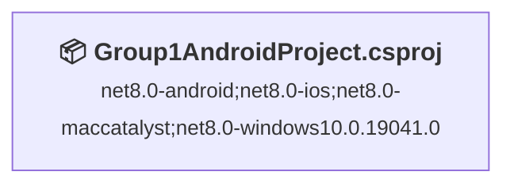
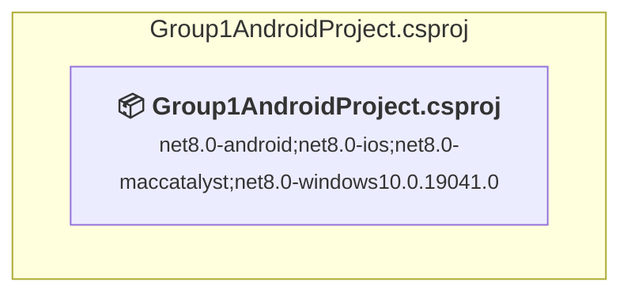

# Projects and dependencies analysis

This document provides a comprehensive overview of the projects and their dependencies in the context of upgrading to .NETCoreApp,Version=v10.0.

## Table of Contents

- [Executive Summary](#executive-Summary)
  - [Highlevel Metrics](#highlevel-metrics)
  - [Projects Compatibility](#projects-compatibility)
  - [Package Compatibility](#package-compatibility)
  - [API Compatibility](#api-compatibility)
  - [Binding Redirect Configuration](#binding-redirect-configuration)
- [Aggregate NuGet packages details](#aggregate-nuget-packages-details)
- [Top API Migration Challenges](#top-api-migration-challenges)
  - [Technologies and Features](#technologies-and-features)
  - [Most Frequent API Issues](#most-frequent-api-issues)
- [Projects Relationship Graph](#projects-relationship-graph)
- [Project Details](#project-details)

  - [Group1AndroidProject\Group1AndroidProject.csproj](#group1androidprojectgroup1androidprojectcsproj)

## Executive Summary

### Highlevel Metrics

| Metric | Count | Status |
| :--- | :---: | :--- |
| Total Projects | 1 | All require upgrade |
| Total NuGet Packages | 4 | 1 need upgrade |
| Total Code Files | 19 |  |
| Total Code Files with Incidents | 3 |  |
| Total Lines of Code | 827 |  |
| Total Number of Issues | 4 |  |
| Estimated LOC to modify | 2+ | at least 0.2% of codebase |

### Projects Compatibility

| Project | Target Framework | Difficulty | Package Issues | API Issues | Binding Issues | Est. LOC Impact | Description |
| :--- | :---: | :---: | :---: | :---: | :---: | :---: | :--- |
| [Group1AndroidProject\Group1AndroidProject.csproj](#group1androidprojectgroup1androidprojectcsproj) | net8.0-android;net8.0-ios;net8.0-maccatalyst;net8.0-windows10.0.19041.0 | 🟢 Low | 1 | 2 | 0 | 2+ | DotNetCoreApp, Sdk Style = True |

### Package Compatibility

| Status | Count | Percentage |
| :--- | :---: | :---: |
| ✅ Compatible | 3 | 75.0% |
| ⚠️ Incompatible | 0 | 0.0% |
| 🔄 Upgrade Recommended | 1 | 25.0% |
| ***Total NuGet Packages*** | ***4*** | ***100%*** |

### API Compatibility

| Category | Count | Impact |
| :--- | :---: | :--- |
| 🔴 Binary Incompatible | 0 | High - Require code changes |
| 🟡 Source Incompatible | 2 | Medium - Needs re-compilation and potential conflicting API error fixing |
| 🔵 Behavioral change | 0 | Low - Behavioral changes that may require testing at runtime |
| ✅ Compatible | 456 |  |
| ***Total APIs Analyzed*** | ***458*** |  |

## Aggregate NuGet packages details

| Package | Current Version | Suggested Version | Projects | Description |
| :--- | :---: | :---: | :--- | :--- |
| Microsoft.Extensions.Logging.Debug | 8.0.1 | 10.0.12 | [Group1AndroidProject.csproj](#group1androidprojectgroup1androidprojectcsproj) | NuGet package upgrade is recommended |
| Microsoft.Maui.Controls |  |  | [Group1AndroidProject.csproj](#group1androidprojectgroup1androidprojectcsproj) | ✅Compatible |
| Microsoft.Maui.Controls.Compatibility |  |  | [Group1AndroidProject.csproj](#group1androidprojectgroup1androidprojectcsproj) | ✅Compatible |
| Npgsql | 9.0.2 |  | [Group1AndroidProject.csproj](#group1androidprojectgroup1androidprojectcsproj) | ✅Compatible |

## Top API Migration Challenges

### Technologies and Features

| Technology | Issues | Percentage | Migration Path |
| :--- | :---: | :---: | :--- |

### Most Frequent API Issues

| API | Count | Percentage | Category |
| :--- | :---: | :---: | :--- |
| M:System.TimeSpan.FromSeconds(System.Double) | 2 | 100.0% | Source Incompatible |

## Projects Relationship Graph

Legend:
📦 SDK-style project
⚙️ Classic project

## Project Details

### Group1AndroidProject\Group1AndroidProject.csproj

#### Project Info

- **Current Target Framework:** net8.0-android;net8.0-ios;net8.0-maccatalyst;net8.0-windows10.0.19041.0
- **Proposed Target Framework:** net8.0-android;net8.0-ios;net8.0-maccatalyst;net8.0-windows10.0.19041.0;net10.0-windows
- **SDK-style**: True
- **Project Kind:** DotNetCoreApp
- **Dependencies**: 0
- **Dependants**: 0
- **Number of Files**: 19
- **Number of Files with Incidents**: 3
- **Lines of Code**: 827
- **Estimated LOC to modify**: 2+ (at least 0.2% of the project)

#### Dependency Graph

Legend:
📦 SDK-style project
⚙️ Classic project

### API Compatibility

| Category | Count | Impact |
| :--- | :---: | :--- |
| 🔴 Binary Incompatible | 0 | High - Require code changes |
| 🟡 Source Incompatible | 2 | Medium - Needs re-compilation and potential conflicting API error fixing |
| 🔵 Behavioral change | 0 | Low - Behavioral changes that may require testing at runtime |
| ✅ Compatible | 456 |  |
| ***Total APIs Analyzed*** | ***458*** |  |

